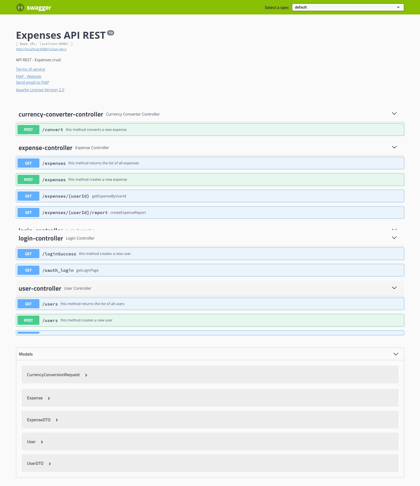

# Gastos

# MBA Fullstack FIAP - Turma 1SCJR

+ RM346614 - Ebertt Costa dos Santos
+ RM346139 - Juliana Mota Carneiro
+ RM347401 - Pamela Lais Oliveira Macedo
+ RM346573 - Rafael Luiz Ross de Moura
+ RM346746 - Vitor Souza Alves 

### Tema

O tema da aplicação é gerenciamento de despesas e conversão de moedas. Através dessa aplicação, é possível registrar e acompanhar as despesas, tornando mais fácil o controle financeiro pessoal ou empresarial. Além disso, a aplicação também permite a conversão entre diferentes moedas, facilitando transações financeiras internacionais e permitindo que o usuário saiba exatamente quanto está gastando em sua moeda local.

### Tecnologias escolhidas
Linguagem: Java 1.8
Framework: Spring Boot versão 2.7.9
Banco de Dados: PostgreSQL

### Endereço do código-fonte 

https://github.com/plomacedo/fiap-gastos

### Página da documentação da API
